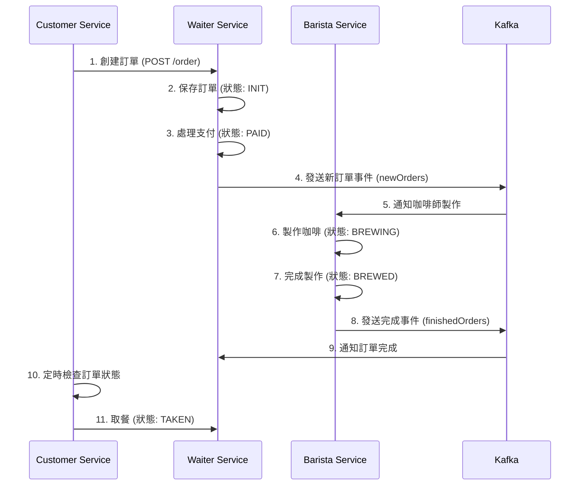

# Spring Cloud Stream 微服務架構實戰 ⚡

[](https://www.oracle.com/java/)
[](https://spring.io/projects/spring-boot)
[](https://spring.io/projects/spring-cloud)
[](https://kafka.apache.org/)
[](https://opensource.org/licenses/MIT)

## 專案介紹

本專案展示如何使用 **Spring Cloud Stream** 結合 **Apache Kafka** 建構一個完整的微服務架構系統，模擬咖啡店訂單處理流程。透過事件驅動架構實現服務間的解耦與非同步通訊。

### 核心功能
- **訂單管理系統**：完整的咖啡訂單生命週期管理
- **事件驅動架構**：使用 Kafka 實現服務間非同步通訊
- **定時任務處理**：自動化訂單狀態監控與處理
- **服務熔斷與限流**：使用 Resilience4j 提供系統穩定性保障

### 解決問題
- 微服務間的高效通訊機制
- 事件驅動架構的實際應用
- 分散式系統的可靠性設計
- 非同步處理與狀態管理

> 💡 **為什麼選擇此架構？**
> - **高可用性**：事件驅動架構提供更好的容錯能力
> - **可擴展性**：微服務架構支援水平擴展
> - **解耦合**：服務間透過事件通訊，降低依賴關係
> - **實時性**：非同步處理提供更好的響應速度

### 🎯 專案特色

- **完整的咖啡店業務流程**：從下單到取餐的完整生命週期
- **多種通訊模式**：同步 REST API + 非同步事件驅動
- **智能定時任務**：自動監控訂單狀態並執行相應動作
- **企業級穩定性**：整合熔斷器、限流器、健康檢查等機制

## 技術棧

### 核心框架
- **Spring Boot 3.4.5** - 微服務基礎框架
- **Spring Cloud Stream 2024.0.2** - 事件驅動架構支援
- **Apache Kafka** - 分散式事件流平台
- **Spring Data JPA** - 資料持久化層

### 開發工具與輔助
- **Resilience4j** - 熔斷器、限流器、隔離器
- **OpenFeign** - 服務間 HTTP 通訊
- **Consul** - 服務註冊與發現
- **MariaDB** - 關聯式資料庫
- **Docker Compose** - 容器化部署

## 專案結構

```
Chapter 15 Spring Cloud Stream/
├── kafka-barista-service/          # 咖啡師服務
│   ├── src/main/java/
│   │   └── tw/fengqing/spring/springbucks/barista/
│   │       ├── integration/        # 事件監聽器
│   │       ├── model/             # 資料模型
│   │       └── repository/        # 資料存取層
│   └── src/main/resources/
│       └── application.properties
├── kafka-waiter-service/           # 服務生服務
│   ├── src/main/java/
│   │   └── tw/fengqing/spring/springbucks/waiter/
│   │       ├── controller/        # REST API 控制器
│   │       ├── integration/       # 事件監聽器
│   │       ├── model/            # 資料模型
│   │       ├── service/          # 業務邏輯層
│   │       └── support/          # 輔助工具類
│   ├── src/main/resources/
│   │   ├── application.properties
│   │   ├── schema.sql            # 資料庫結構
│   │   └── data.sql             # 初始資料
│   └── docker-compose.yml       # Kafka 環境配置
└── scheduled-customer-service/    # 客戶服務
    ├── src/main/java/
    │   └── tw/fengqing/spring/springbucks/customer/
    │       ├── controller/       # REST API 控制器
    │       ├── integration/      # Feign 客戶端
    │       ├── model/           # 資料模型
    │       ├── scheduler/       # 定時任務
    │       └── support/         # 輔助工具類
    └── src/main/resources/
        └── application.properties
```

## 快速開始

### 前置需求
- **Java 21** 或更高版本
- **Maven 3.6+** 建構工具
- **Docker & Docker Compose** 容器化環境
- **MariaDB** 資料庫（或使用 Docker 容器）

### 安裝與執行

1. **克隆此倉庫：**
```bash
git clone https://github.com/SpringMicroservicesCourse/spring-microservices-course.git
cd "Chapter 15 Spring Cloud Stream"
```

2. **啟動基礎設施服務：**
```bash
# 啟動 Kafka 環境
cd kafka-waiter-service
docker-compose up -d

# 啟動 MariaDB（如果沒有本地安裝）
docker run -d --name mariadb \
  -e MYSQL_ROOT_PASSWORD=root \
  -e MYSQL_DATABASE=springbucks \
  -e MYSQL_USER=springbucks \
  -e MYSQL_PASSWORD=springbucks \
  -p 3306:3306 \
  mariadb:latest
```

3. **編譯所有專案：**
```bash
# 編譯 waiter-service
cd kafka-waiter-service
mvn clean compile

# 編譯 barista-service
cd ../kafka-barista-service
mvn clean compile

# 編譯 customer-service
cd ../scheduled-customer-service
mvn clean compile
```

4. **依序啟動服務：**
```bash
# 終端機 1：啟動 waiter-service (端口 8080)
cd kafka-waiter-service
mvn spring-boot:run

# 終端機 2：啟動 barista-service (端口 8070)
cd kafka-barista-service
mvn spring-boot:run

# 終端機 3：啟動 customer-service (端口 8090)
cd scheduled-customer-service
mvn spring-boot:run
```

5. **測試系統功能：**
```bash
# 查看咖啡菜單
curl http://localhost:8080/coffee/

# 創建新訂單
curl -X POST http://localhost:8090/customer/order

# 查看訂單狀態
curl http://localhost:8080/order/1
```

## 系統架構說明

### 服務職責分工

| 服務 | 端口 | 主要職責 | 關鍵功能 |
|------|------|----------|----------|
| **waiter-service** | 8080 | 訂單管理 | 接收訂單、管理菜單、處理支付 |
| **barista-service** | 8070 | 咖啡製作 | 接收製作請求、更新訂單狀態 |
| **customer-service** | 8090 | 客戶端 | 下單、監控訂單、自動取餐 |

### 事件流程圖



## 進階說明

### 環境變數配置
```properties
# 資料庫連接設定
DB_URL=jdbc:mariadb://localhost:3306/springbucks
DB_USERNAME=springbucks
DB_PASSWORD=springbucks

# Kafka 連接設定
KAFKA_BROKERS=localhost:9092

# 服務發現設定
CONSUL_HOST=localhost
CONSUL_PORT=8500
```

### 關鍵配置說明

#### Kafka 配置
```properties
# Spring Cloud Stream Kafka 綁定器配置
spring.cloud.stream.kafka.binder.brokers=localhost
spring.cloud.stream.kafka.binder.defaultBrokerPort=9092

# 函數式編程模型配置
spring.cloud.function.definition=newOrders
spring.cloud.stream.bindings.newOrders-in-0.destination=newOrders
spring.cloud.stream.bindings.newOrders-in-0.group=barista-service
```

#### 熔斷器配置
```properties
# Resilience4j 熔斷器設定
resilience4j.circuitbreaker.instances.order.failure-rate-threshold=50
resilience4j.circuitbreaker.instances.order.wait-duration-in-open-state=5000
resilience4j.circuitbreaker.instances.order.ring-buffer-size-in-closed-state=5
```

### 核心程式碼解析

#### 事件監聽器 (Barista Service)
```java
/**
 * 訂單監聽器 - 處理新訂單並製作咖啡
 * 使用 Spring Cloud Stream 函數式編程模型
 */
@Component
@Slf4j
@Transactional
public class OrderListener {
    
    /**
     * 處理新訂單的函數式 Bean
     * 接收新訂單 ID，製作咖啡並發送完成消息
     */
    @Bean
    public Consumer<Long> newOrders() {
        return id -> {
            // 查詢訂單資訊
            CoffeeOrder order = orderRepository.findById(id).orElse(null);
            if (order == null) {
                log.warn("Order id {} is NOT valid.", id);
                throw new IllegalArgumentException("Order ID is INVALID!");
            }
            
            // 製作咖啡並更新狀態
            order.setState(OrderState.BREWED);
            order.setBarista(barista);
            orderRepository.save(order);
            
            // 發送完成事件
            Message<Long> message = MessageBuilder.withPayload(id).build();
            streamBridge.send(Waiter.FINISHED_ORDERS, message);
        };
    }
}
```

#### 定時任務 (Customer Service)
```java
/**
 * 咖啡訂單定時監控器
 * 自動檢查訂單狀態並執行取餐動作
 */
@Component
@Slf4j
public class CoffeeOrderScheduler {
    
    /**
     * 定時檢查訂單狀態 (每秒執行一次)
     * 當訂單狀態為 BREWED 時自動取餐
     */
    @Scheduled(fixedRate = 1000)
    public void waitForCoffee() {
        if (orderMap.isEmpty()) {
            return;
        }
        
        log.info("I'm waiting for my coffee.");
        orderMap.values().stream()
                .map(o -> coffeeOrderService.getOrder(o.getId()))
                .filter(o -> OrderState.BREWED == o.getState())
                .forEach(o -> {
                    log.info("Order [{}] is READY, I'll take it.", o);
                    // 更新訂單狀態為已取餐
                    coffeeOrderService.updateState(o.getId(),
                            OrderStateRequest.builder()
                                    .state(OrderState.TAKEN).build());
                    orderMap.remove(o.getId());
                });
    }
}
```

## API 文件

### Waiter Service API

| 方法 | 路徑 | 說明 | 範例 |
|------|------|------|------|
| GET | `/coffee/` | 取得咖啡菜單 | `curl http://localhost:8080/coffee/` |
| POST | `/order/` | 創建新訂單 | `curl -X POST http://localhost:8080/order/ -H "Content-Type: application/json" -d '{"customer":"張三","items":["拿鐵","美式"]}'` |
| GET | `/order/{id}` | 查詢訂單狀態 | `curl http://localhost:8080/order/1` |
| PUT | `/order/{id}` | 更新訂單狀態 | `curl -X PUT http://localhost:8080/order/1 -H "Content-Type: application/json" -d '{"state":"PAID"}'` |

### Customer Service API

| 方法 | 路徑 | 說明 | 範例 |
|------|------|------|------|
| GET | `/customer/menu` | 查看菜單 | `curl http://localhost:8090/customer/menu` |
| POST | `/customer/order` | 下單並支付 | `curl -X POST http://localhost:8090/customer/order` |

## 監控與管理

### 健康檢查端點
```bash
# 檢查服務健康狀態
curl http://localhost:8080/actuator/health
curl http://localhost:8070/actuator/health
curl http://localhost:8090/actuator/health

# 查看應用資訊
curl http://localhost:8080/actuator/info
```

### 指標監控
```bash
# 查看應用指標
curl http://localhost:8080/actuator/metrics
curl http://localhost:8080/actuator/metrics/jvm.memory.used
```

## 參考資源

- [Spring Cloud Stream 官方文件](https://spring.io/projects/spring-cloud-stream)
- [Apache Kafka 官方文件](https://kafka.apache.org/documentation/)
- [Resilience4j 官方文件](https://resilience4j.readme.io/)
- [Spring Boot Actuator 監控指南](https://docs.spring.io/spring-boot/docs/current/reference/html/actuator.html)

## 注意事項與最佳實踐

### ⚠️ 重要提醒

| 項目 | 說明 | 建議做法 |
|------|------|----------|
| **資料庫連線** | MariaDB 連線設定 | 使用連線池，設定適當的超時時間 |
| **Kafka 配置** | 訊息佇列設定 | 根據業務需求調整分區數和複製因子 |
| **服務發現** | Consul 註冊設定 | 確保服務名稱唯一，避免衝突 |
| **熔斷器** | 故障處理機制 | 根據實際業務調整失敗閾值和恢復時間 |

### 🔒 最佳實踐指南

- **事件設計**：確保事件結構穩定，避免破壞性變更
- **錯誤處理**：實作完整的異常處理和重試機制
- **監控告警**：設定關鍵指標的監控和告警
- **資料一致性**：使用分散式事務或補償機制確保資料一致性
- **效能優化**：合理設定 Kafka 批次大小和消費者組配置

### 🚀 擴展建議

- **水平擴展**：可以啟動多個 barista-service 實例來提高處理能力
- **訊息持久化**：根據業務需求設定適當的訊息保留時間
- **監控整合**：整合 Prometheus + Grafana 進行更詳細的監控
- **日誌聚合**：使用 ELK Stack 進行集中式日誌管理

## 授權說明

本專案採用 MIT 授權條款，詳見 LICENSE 檔案。

## 關於我們

我們主要專注在敏捷專案管理、物聯網（IoT）應用開發和領域驅動設計（DDD）。喜歡把先進技術和實務經驗結合，打造好用又靈活的軟體解決方案。

## 聯繫我們

- **FB 粉絲頁**：[風清雲談 | Facebook](https://www.facebook.com/profile.php?id=61576838896062)
- **LinkedIn**：[linkedin.com/in/chu-kuo-lung](https://www.linkedin.com/in/chu-kuo-lung)
- **YouTube 頻道**：[雲談風清 - YouTube](https://www.youtube.com/channel/UCXDqLTdCMiCJ1j8xGRfwEig)
- **風清雲談 部落格**：[風清雲談](https://blog.fengqing.tw/)
- **電子郵件**：[fengqing.tw@gmail.com](mailto:fengqing.tw@gmail.com)

---

**📅 最後更新：2025年9月**  
**👨‍💻 維護者：風清雲談團隊**